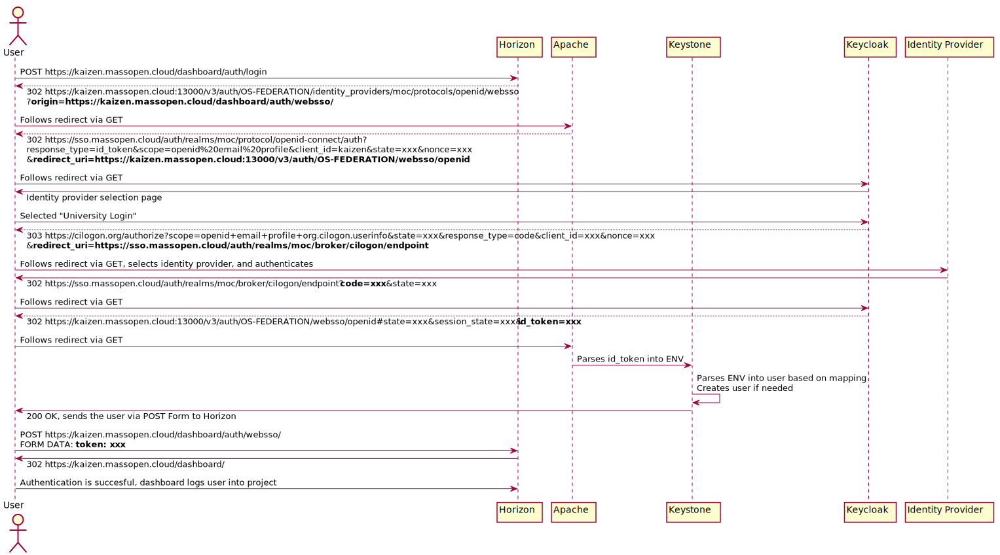
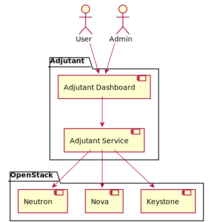

# Integration with OpenStack

OpenStack [supports single
sign-on](https://docs.openstack.org/keystone/wallaby/admin/federation/configure_federation.html)
via the `mapped` plugin for Keystone (the OpenStack identity service.)

Keystone does not handle, or speak any of the identity federation protocols,
instead letting the implementation be handled by the Apache service that it is
running on.

After that, the `mapped` plugin *maps* the environment variables that the
Apache server returns to it.

The guide linked above describes the process of configuring Keystone for either
OpenID Connect or SAML2. We have chosen to use OpenID Connect using the
`mod_auth_openidc` Apache plugin.



## Authentication

These are the mapping rules that we're using. All they do is map the OpenStack
user's username to the `preferred_username` claim in the `id_token`. Note that
`mod_auth_openidc` [does set a prefix to the environment variable by
default](https://github.com/zmartzone/mod_auth_openidc/blob/c6917b518d8225800a3f26a2becd774ea85e8b4c/auth_openidc.conf#L716).
More claims can be added to the `id_token`, `access_token`, or
`userinfo_endpoint` by [configuring Mappers in
Keycloak](https://www.keycloak.org/docs/latest/server_admin/#_protocol-mappers).

```json
[
    {
      "local": [
        {
          "user": {
            "name": "{0}"
          }
        }
      ],
      "remote": [
        {
          "type": "OIDC-preferred_username"
        }
      ]
    }
  ]
```

### CLI/SDK Authentication

OpenID Connect works well in a browser, however for cases where our users need to access the API directly in situations where a browser is unavailable, we [encourage usage of application credentials](https://osticket.massopen.cloud/kb/faq.php?id=16).

The limitations of this method are that the authentication happens only in
Keystone and doesn't flow all the way back to the user's identity provider.

However, as described below, we're not using the data received from the
identity provider for anything other than authentication, so the user's source
of truth for their level of authorization is still Keystone.

## Authorization

The only information that Keystone receives and makes use of from Keycloak is a
user's username for authentication purposes. The level of access is stored in
Keystone itself in the form of `user`, `project`, `role` assignments. A
keystone project is a container for resources, whereas a role describes the
level of authorization.

Users by default are not allowed to create or modify projects in any way. And
it is still [not possible to have a user's adminness be limited to a single
project by using keystone
alone](https://bugs.launchpad.net/keystone/+bug/968696).

Therefore it is necessary to implement an external service to provide
self-service project management capabilities. For that we are using
[Adjutant](https://docs.openstack.org/adjutant/latest/), and we have built a [plugin to implement our tasks](https://github.com/CCI-MOC/adjutant-moc), and a [dashboard that is based on Horizon and the Adjutant UI plugin for Horizon](https://github.com/CCI-MOC/horizon-onboarding).



## Future Explorations

Since we're using the Queens release, we're not making use of 2 features that
we implemented in Keystone as part of the Ussuri release of OpenStack.

## Expiring Group Membership

It is possible to store `user`, `group` relationship in the Keycloak user database. These relationships can then be carried over via claims in the `id_token` and used by Keystone to map the user to already existing groups in Keystone.

Prior to the Ussuri release, the mapping `user` to `group` would not be persisted in the database, making it impossible to create application credentials.

Since the Ussuri release, [it is possible to configure keystone to persist
these relationships for a configurable and expirable amount of
time](https://specs.openstack.org/openstack/keystone-specs/specs/keystone/ussuri/expiring-group-memberships.html).

## CRUD for Federated Users

Prior to the Ussuri release, it wasn't possible to create a federated user in Keystone before their first authentication.

This created a chicken and egg problem where a user needs to authenticate
first, before they can be added to a project. However they don't have a
project, so authentication in the dashboard will fail (but the process of
failing will create the user in the keystone database.)

Since the Ussuri release, [it is now possible to create federated user's ahead of time through the REST API](https://specs.openstack.org/openstack/keystone-specs/specs/keystone/ussuri/support-federated-attr.html).
