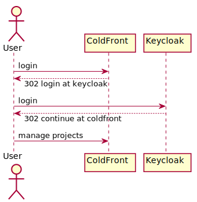
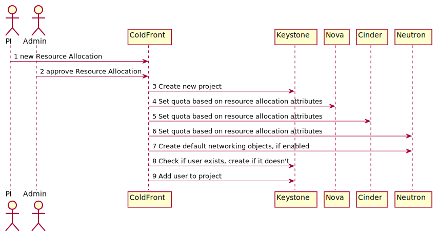

# NERC OpenStack

## Authentication
Use Keycloak and OpenID Connect for authentication.

**Users are uniquely identified by their email address.**

## Authorization
Use ColdFront for resource allocation and pushing authorizations to the services.

### 3. Create Project
- https://docs.openstack.org/api-ref/identity/v3/#create-project
- https://docs.openstack.org/python-keystoneclient/latest/api/keystoneclient.v3.html#keystoneclient.v3.projects.ProjectManager.create

### 4-6. Set Quotas
- Sample python code available in the adjutant implementation
    - https://github.com/openstack/adjutant/blob/master/adjutant/common/quota.py

### 7. Create Default Networking
- Can be implemented using "Get me a network"
- Or
    - Create a network
    - Create a subnet
    - Create a router attaching network to `external` network

### 8. Create user
- https://specs.openstack.org/openstack/keystone-specs/specs/keystone/ussuri/support-federated-attr.html

### 9. Add User to Project
- Assign role `member` to user on project
